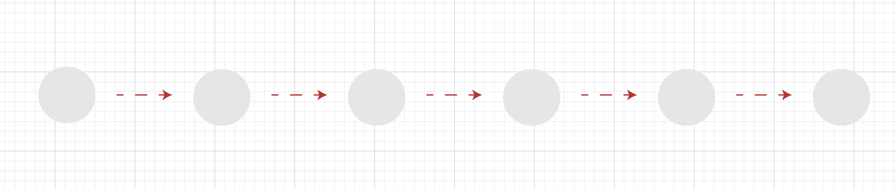
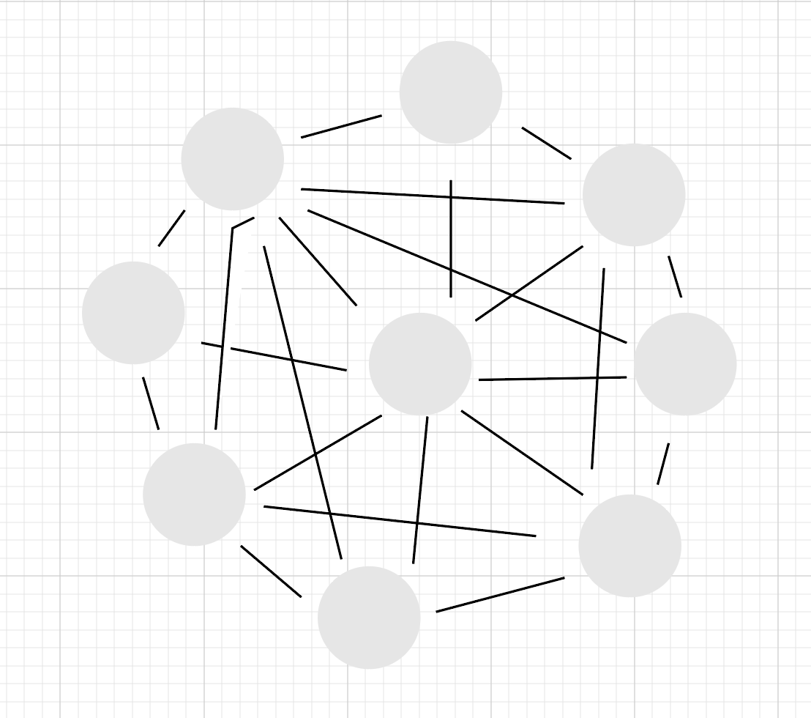
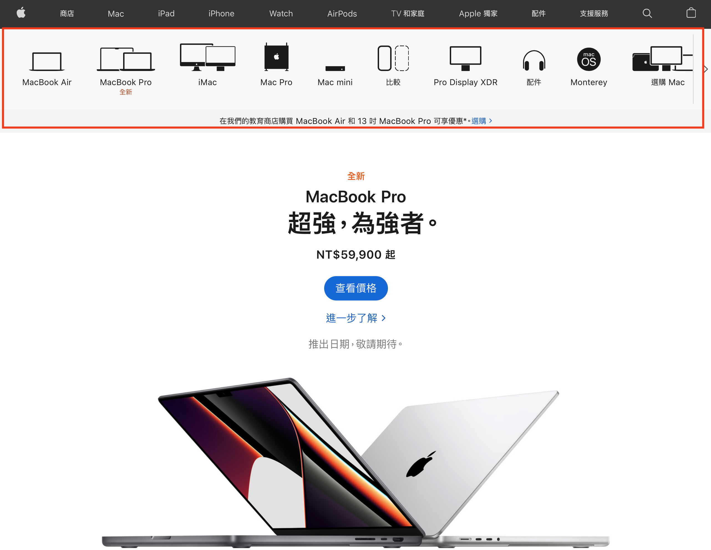
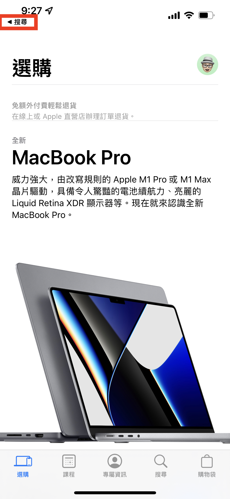
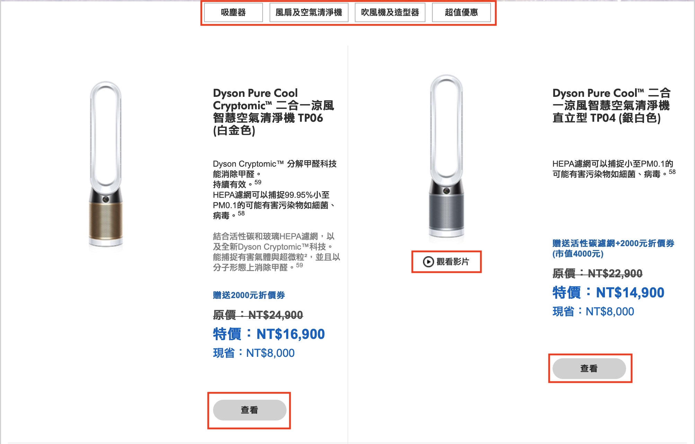
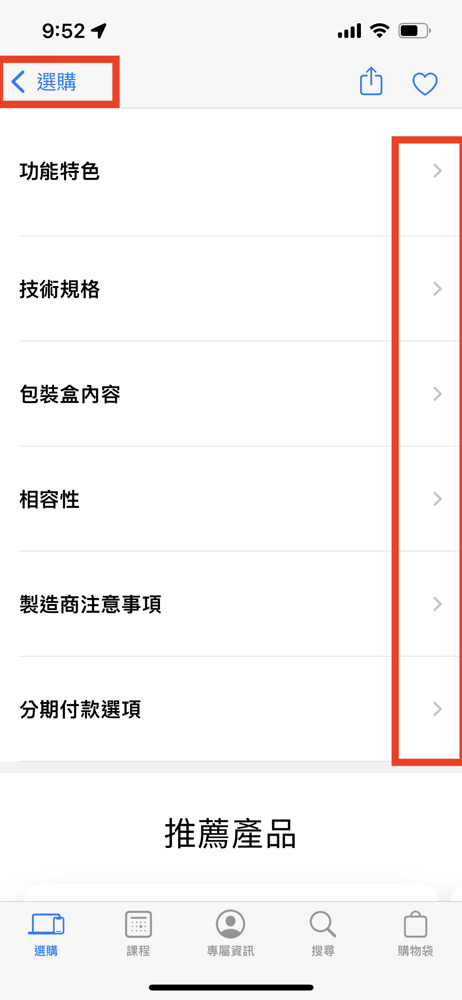
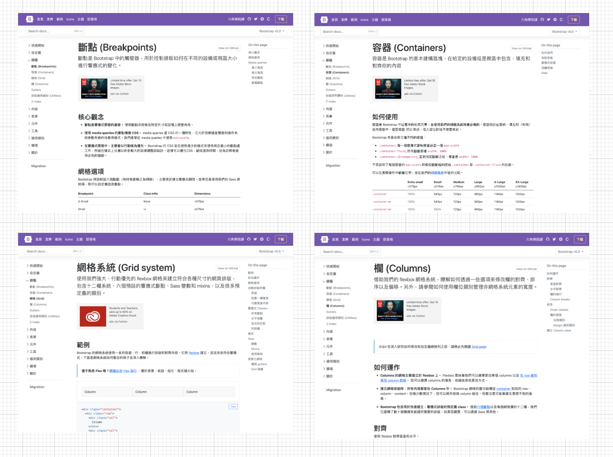
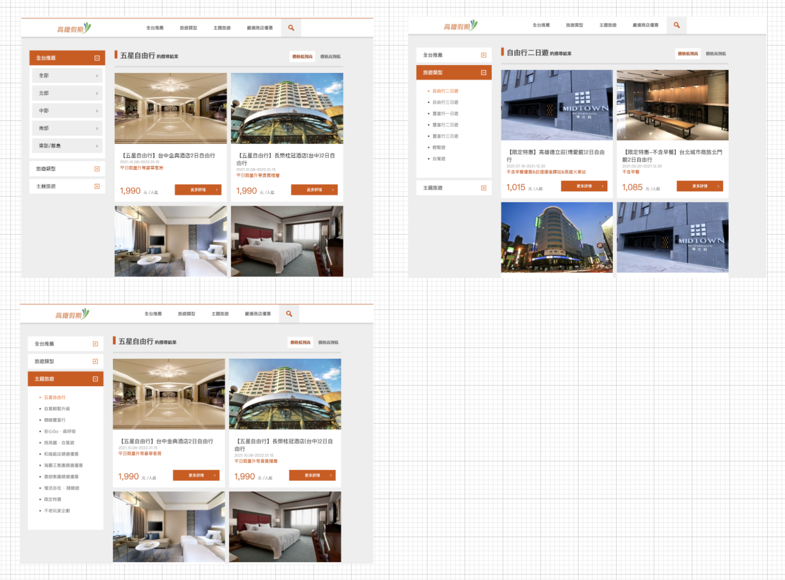

## 垂直、水平、前後的立體構造
 1. ## 連結帶來的影響  

>  資訊的相關性

網站與應用程式。儘管在「要表現某些事物」這點是一樣的，但是從書籍與海報在本質上的差異來看，透過「連結」可讓不同的元素彼此串聯，並往返於各元素之間。不管是PC、智慧型手機、平板電腦，網站或應用程式該從何處來，又該往何處去，都有因「連結」而產生的資訊相關性。因此，關於網站或應用程式的設計，其設計的關鍵在於「如何讓每個元素彼此串聯」這點。

> 難用與難懂

難用與難懂的解決方式就是建立一套操作方式

 2. ## 掌握身在何處的四個元素  

#### 方便使用者移動的4個方法:
1. 現在位於哪一個頁面
2. 這個頁面的內容為何
3. 從哪裏來到這個頁面
4. 接下來可以前往那一個頁面

當使用者了解這四點之後，就能流暢地在各個頁面之間移動。即使有些許不了解，也無大
礙，但上述四點全部不了解的話，就無法移動了。因為要在頁面之間移動，必須先了解頁面
的前後關係，也必須了解現在的頁面與整體網站之間的相對位置

####  4個方法的表現方式

1. 現在位於哪一個頁面
	- 標題和導覽列可以說明

---

2. 這個頁面的內容為何
	- 標題和內容

---

3. 從哪裏來到這個頁面
	- 利用瀏灠器的上一頁
	- 利用互動性

---

4. 接下來可以前往那一個頁面
	- 導覽列和按鈕

---
	
 
 4. ## 讓頁面的前後關系視覺化 

#### 以視覺的方式了解頁面的前後關係

要說明「從哪裡來到這個頁面」的方法之一就是在視覺呈現上下工夫最直接的方法就是直接顯示「從哪裡來到這個頁面」的訊息。例如i0S 的智慧型手機與平板電腦的應用程式為子讓使用者可以回到上個頁面，在頁首的左側設置了「從哪裡來到這個頁面」的按鈕。

---

網站則是會在網頁外側設置「回上一頁，按鈕，所以就不需要設計類似 i0S 的功能了

---

#### 利用網頁變化量表現前後關係

更間接的表現方式就是頁面移動之後，網頁產生的「變化量」。往下一個頁面移動時，可
以將下一個頁面的視覺元素全部換掉，也可以只換掉局部的元素。如果要說哪一種是往較遠
的頁面移動的話，那絕對是全部換掉的前者。當頁面的構造與功能大幅改變時，頁面的編排
也會變得不同，頁面的變化量當然也就變大，相對的，如果下一個頁面的功能不變或是只有
一些相似的地方改變，頁面的變化量當然就比較小。

「掌控頁面的變化量」是一種讓使用者能憑著感覺了解頁面前後關係的設計，當變化量越
大，使用者就覺得移動到越遠的頁面，反之變量越小，使用者就覺得只移動到附近的頁面，因此只要根據前後頁面的變化量就能掌握頁面的距離，也能了解頁面所扮演的角色或功
能有什麼差異了。

##### 變化量小的網頁

 
 5. ## 利用互動性表現頁面的前後關係  
 
 6. ## 讓使用者透過視覺設計判斷目前所在位置  
 
 7. ## 階層的廣度、深度與標籤的關係  

